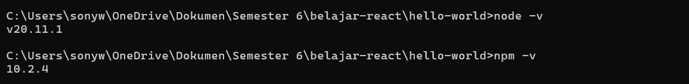
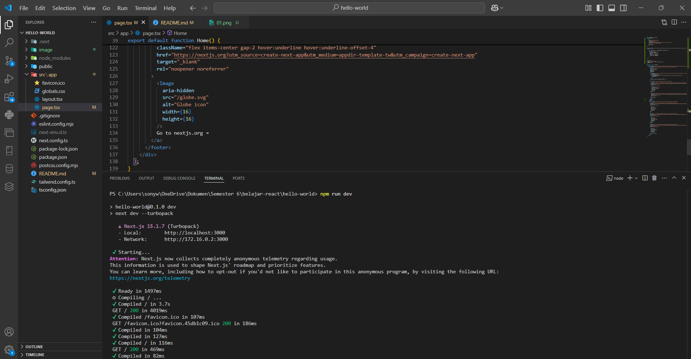
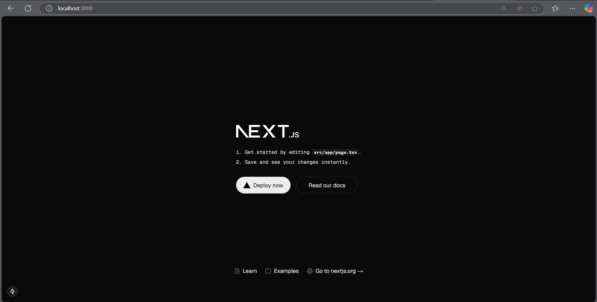
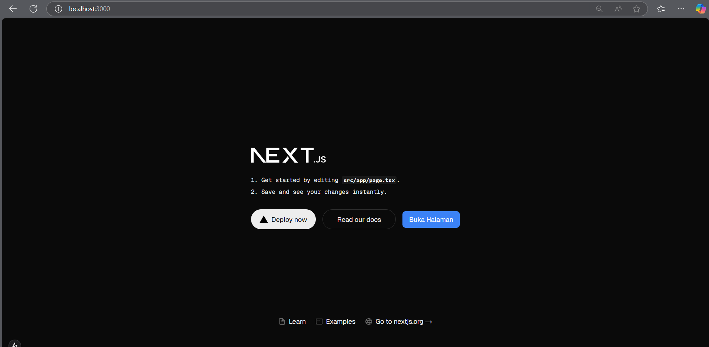
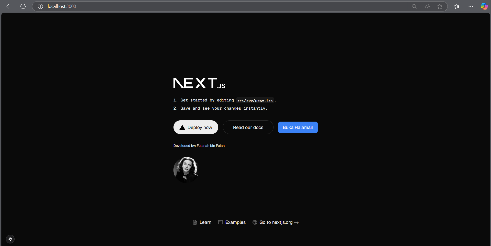

## Laporan Praktikum

|       | Pemrograman Berbasis Framework 2024 |
| ----- | ----------------------------------- |
| NIM   | 2241720202                          |
| Nama  | Sony Febri Hari Wibowo              |
| Kelas | TI - 3D                             |

### Pertanyaan Praktikum 1

1. Jelaskan kegunaan masing-masing dari Git, VS Code dan NodeJS yang telah Anda install
   pada sesi praktikum ini!
   - Git digunakan untuk melacak perubahan pada kode, mempermudah kolaborasi tim, dan memungkinkan pengelolaan branch untuk pengembangan fitur baru tanpa mengganggu kode utama
   - Visual Studio Code (VS Code) digunakan sebagai code editor
   - Node.js digunakan untuk menjalankan JavaScript di luar browser yang memiliki tool NPM yang akan digunakan untuk mengelola package
2. Buktikan dengan screenshoot yang menunjukkan bahwa masing-masing tools tersebut
   telah berhasil terinstall di perangkat Anda!
   

### Pertanyaan Praktikum 2

1. Pada Langkah ke-2, setelah membuat proyek baru menggunakan Next.js, terdapat beberapa
   istilah yang muncul. Jelaskan istilah tersebut, TypeScript, ESLint, Tailwind CSS, App
   Router, Import alias, App router, dan Turbopack!
   - TypeScript: Versi JavaScript yang mendukung penulisan tipe data untuk membuat kode lebih aman dan mudah dipahami.
   - ESLint: Alat untuk memeriksa dan memperbaiki kesalahan atau gaya penulisan kode JavaScript/TypeScript agar lebih konsisten.
   - Tailwind CSS: Framework CSS berbasis utility classes yang mempermudah penataan desain langsung di HTML.
   - Import alias: Fitur untuk mengganti path file yang panjang dengan nama pendek agar lebih rapi dan mudah dibaca.
   - App Router: Fitur di framework seperti Next.js untuk mengatur navigasi dan halaman aplikasi secara efisien.
   - Turbopack: Bundler baru untuk mem-build aplikasi web, alternatif dari Webpack.
2. Apa saja kegunaan folder dan file yang ada pada struktur proyek React yang tampil pada
   gambar pada tahap percobaan ke-3!
   - pages/: Menyimpan file halaman aplikasi dan API routes.
   - public/: Menyimpan aset statis (gambar, favicon, dll).
   - styles/: Berisi file CSS untuk styling.
   - package.json: Mengelola dependensi dan skrip project.
   - .gitignore: Daftar file/folder yang diabaikan Git.
   - README.md: Dokumentasi dasar project.
   - next.config.js: Konfigurasi tambahan untuk Next.js.
   - node_modules/: Folder dependensi yang diinstal.
   - .next/: Folder build aplikasi
3. Buktikan dengan screenshoot yang menunjukkan bahwa tahapan percobaan di atas telah
   berhasil Anda lakukan!
   
   

### Pertanyaan Praktikum 3

1. Buktikan dengan screenshoot yang menunjukkan bahwa tahapan percobaan di atas telah
   berhasil Anda lakukan!
   

### Pertanyaan Praktikum 4

1. Untuk apakah kegunaan sintaks user.imageUrl?
   - user.imageUrl digunakan untuk mengakses properti imageUrl dari objek user. Properti ini berisi URL gambar ('https://i.imgur.com/yXOvdOSs.jpg'), yang kemudian digunakan sebagai nilai atribut src pada elemen img
2. Buktikan dengan screenshoot yang menunjukkan bahwa tahapan percobaan di atas telah
   berhasil Anda lakukan!
   
